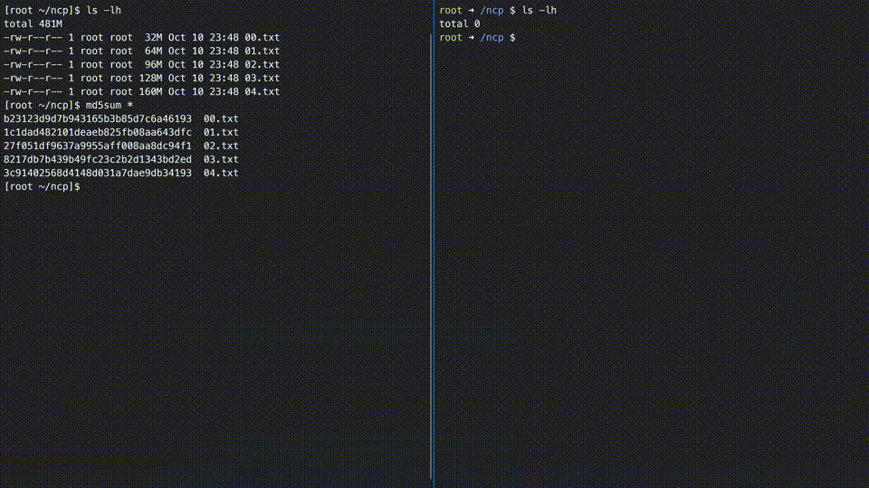

# Net Copy

A simple command line tool to transfer files with HTTP



## Features

- Send/Receive directly from Web Browser (open the generated HTTP URL)
- Support OSC52 (auto copy the first `curl` command to system clipboard)

# Usage

## Help

```text
A simple command line tool to transfer files with HTTP

Usage: ncp [OPTIONS] [FILES]...

Arguments:
  [FILES]...  The files to be sent, empty means serve as receiver

Options:
  -l, --host <HOST>         The host ip for the server
  -p, --port <PORT>         The port for the server
  -k, --key <STRING>        The secret key for the server
  -r, --reserve             Whether reserve the full path of the received file
  -x, --proxy <PROXY>       Proxy for TCP connection
  -X, --no-proxy            Disable automatically check proxy from gateway
  -m, --mode <MODE>         Serve mode [possible values: normal, proxy]
  -a, --auto-rename         Auto rename file if exist
  -s, --prompt-save-config  Whether show save config prompt
  -h, --help                Print help
  -V, --version             Print version
```

The options will first parse from command line, then from environment variables (env), finally from config file.

The env name is `NCP_<UPPER_CASE_OF_OPTION>`, e.g. `NCP_KEY`, `NCP_AUTO_RENAME`.

The config file path may be `~/.config/ncp.toml` or `/etc/ncp.toml` (Unix-like), `%APPDATA%\ncp.toml` (Windows), the first has higher priority.

## Send

### One file

```text
$ ncp `which ncp`

1: <lo> 10.255.255.254
2: <eth0> 172.23.222.35
3: <docker0> 172.17.0.1
4: <eth0> [fe80::215:5dff:feb7:8fef]
5: <docker0> [fe80::80a3:71ff:fefe:464a]
6: <veth4c6f44e> [fe80::c001:8ff:fe5b:ccaf]
Please choose one in 1..6: 2

cURL: curl -o "ncp" http://172.23.222.35:16569/ruPnoe
Wget: wget -O "ncp" http://172.23.222.35:16569/ruPnoe
```

### Multiple files

```text
$ ncp `ls`

1: <lo> 10.255.255.254
2: <eth0> 172.23.222.35
3: <docker0> 172.17.0.1
4: <eth0> [fe80::215:5dff:feb7:8fef]
5: <docker0> [fe80::80a3:71ff:fefe:464a]
6: <veth4c6f44e> [fe80::c001:8ff:fe5b:ccaf]
Please choose one in 1..6: 2

cURL: curl http://172.23.222.35:24530/zDvN1p | tar xvf -
Wget: wget -O- http://172.23.222.35:24530/zDvN1p | tar xvf -
```

## Receive

```text
$ ncp

1: <lo> 10.255.255.254
2: <eth0> 172.23.222.35
3: <docker0> 172.17.0.1
4: <eth0> [fe80::215:5dff:feb7:8fef]
5: <docker0> [fe80::80a3:71ff:fefe:464a]
6: <veth4c6f44e> [fe80::c001:8ff:fe5b:ccaf]
Please choose one in 1..6: 2

cURL (Bash): for f in <FILES>; do curl -X POST -H "File-Path: $f" -T $f http://172.23.222.35:22794/2BIIgp; done
cURL (PowerShell): foreach ($f in "f1", "f2") { curl -X POST -H "File-Path: $f" -T $f http://172.23.222.35:22794/2BIIgp }
cURL (CMD): FOR %f IN (f1, f2) DO curl -X POST -H "File-Path: %f" -T %f http://172.23.222.35:22794/2BIIgp
```

## Proxy

The proxy works as a server, and the sender/receiver detect proxy automatically from all network gateways, or you can specific proxy servers from cli/env/config.

# Note

- If you get an error related to [glibc](https://www.gnu.org/software/libc/), please use the [musl](https://musl.libc.org/) version, which is static linking
- For android, you can use the `-unknown-linux-musl` version
